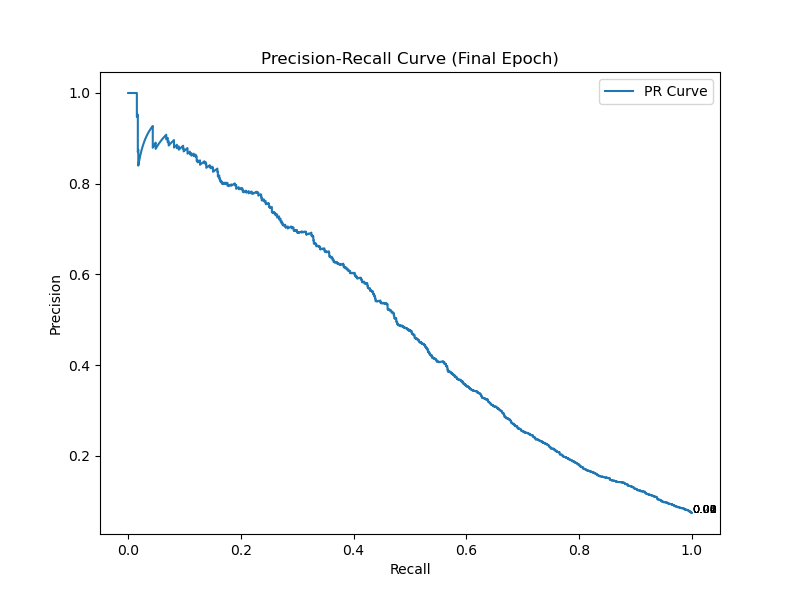

# TOX21 Graph Neural Network Project

## Project Goal
The goal of this project is to develop and evaluate various Graph Neural Network (GNN) models for predicting the toxicity of chemical compounds using the TOX21 dataset. The TOX21 dataset contains information about the biological activities of chemical compounds, which can be represented as graphs where nodes are atoms and edges are bonds.

## TOX 21 Dataset
https://paperswithcode.com/dataset/tox21-1

The Tox21 data set comprises 12,060 training samples and 647 test samples that represent chemical compounds. There are 801 "dense features" that represent chemical descriptors, such as molecular weight, solubility or surface area, and 272,776 "sparse features" that represent chemical substructures (ECFP10, DFS6, DFS8; stored in Matrix Market Format ). Machine learning methods can either use sparse or dense data or combine them. For each sample there are 12 binary labels that represent the outcome (active/inactive) of 12 different toxicological experiments. Note that the label matrix contains many missing values (NAs). The original data source and Tox21 challenge site is https://tripod.nih.gov/tox21/challenge/.

## Why Graph Neural Networks?
Graph Neural Networks (GNNs) are particularly well-suited for this task because chemical compounds are naturally represented as graphs. In these graphs:
- **Nodes** represent atoms.
- **Edges** represent chemical bonds between atoms.

GNNs can effectively capture the complex relationships and interactions between atoms in a molecule. By leveraging the graph structure, GNNs can:
1. **Aggregate Information**: GNNs aggregate information from neighboring nodes, allowing them to learn the local structure and properties of each atom.
2. **Learn Edge Features**: GNNs can incorporate edge features (e.g., bond types) to better understand the interactions between atoms.
3. **Global Context**: Through multiple layers of graph convolutions, GNNs can capture both local and global structural information, which is crucial for accurately predicting molecular properties.

## Strategies
We employ several GNN architectures to predict the toxicity tasks in the TOX21 dataset:
1. **GCN (Graph Convolutional Network)**: Utilizes graph convolutional layers to aggregate information from neighboring nodes.
2. **GAT (Graph Attention Network)**: Employs attention mechanisms to weigh the importance of neighboring nodes.
3. **NNConv (Neural Network Convolution)**: Uses neural networks to learn edge-specific filters for convolution.
4. **EdgeConv (Edge Convolution)**: Applies convolution operations on edges to capture relationships between nodes.

Each model is trained to predict 12 different toxicity tasks, and we evaluate their performance using metrics such as accuracy, precision, recall, F1 score, and ROC-AUC.

## Methodology

Our experimental pipeline consists of:
1. Data analysis
2. Data preprocessing and cleaning
3. Molecular feature extraction from SMILES notation
4. Dataset stratification and scaling
5. Model training and hyperparameter tuning
6. Comprehensive performance evaluation across multiple metrics

## Baseline Methods

To establish performance benchmarks before implementing more complex Graph Neural Networks (GNNs), we evaluated several classical machine learning approaches on the Tox21 dataset. These baseline models provide a foundation for comparing the effectiveness of more sophisticated architectures.

### Implementation

We developed three tree-based ensemble models:
- Random Forest
- XGBoost
- Gradient Boosting

Each model predicts multiple toxicity endpoints using molecular features extracted from SMILES representations. For molecular featurization, we employed a bag-of-words encoding approach, which converts chemical structures into numerical vectors while preserving key molecular information.

### Baseline Performance Comparison

The results provide baseline performance metrics (see table below).

| Metric | Random Forest | XGBoost | Gradient Boosting |
|--------|--------------|---------|------------------|
| Precision | 79.69% | 73.33% | 56.22% |
| Recall | 9.27% | 18.01% | 20.71% |
| F1 Score | 13.91% | 27.31% | 29.10% |
| Accuracy | 92.70% | 93.12% | 92.91% |
| ROC AUC | 81.07% | 79.52% | 79.29% |

- Random Forest achieves highest precision and ROC AUC

### Threshold Selection for Classification

In predictive modeling for toxicity classification, the choice of the threshold value plays a critical role in determining the balance between false positives and false negatives. For the TOX21 dataset, our primary concern was to minimize false negatives, as missing potentially toxic compounds could have severe consequences. However, determining an optimal threshold that achieves a balanced trade-off between precision and recall proved challenging.

#### Analysis of Precision-Recall Trade-off
We evaluated the precision and recall trade-off by plotting the Precision-Recall (PR) curves for each model. The analysis revealed the following:
- **Precision drops as recall improves**: While increasing the recall to 0.8 ensures a higher capture rate of toxic compounds, the precision drops significantly, falling below 0.2. This indicates that a large proportion of the predicted toxic compounds are false positives.
- **No optimal balance**: Despite exploring various threshold values, we were unable to find a point where both precision and recall achieved a satisfactory balance. The inherent trade-off reflects the challenge of working with an imbalanced dataset, where the number of inactive compounds significantly outweighs active ones.

#### Implications of Dataset Imbalance
The TOX21 dataset's imbalance, with far more inactive compounds than active ones, contributes to the skewed precision-recall dynamics. This imbalance affects the model's ability to achieve high recall without sacrificing precision:
- **Recall-focused approach**: Lowering the threshold increases recall, capturing more true positives but also introducing a higher number of false positives.
- **Precision-focused approach**: Raising the threshold improves precision by reducing false positives, but at the cost of missing a substantial number of true positives (reduced recall).

## Grid Search Overview

The table below summarizes the key hyperparameters used for each model in our experiments. These parameters were optimized using grid search to find the best configuration for each model's architecture and task.

### Notes:
- When a parameter is marked with a `-`, it means that the parameter is not applicable to the specific model then it was not included in the grid search optimization for that model.
- the parameters for learning rate and the other parameters are trained separately in order to optimized the computational time.

## Hyperparameters Table

| Models      | Factor |    LR   |  Min LR  | Patience | Threshold | Dropout | Hidden Dim | Num Heads | Num Layers | Edge Hidden |
|-------------|:------:|:-------:|:--------:|:--------:|:---------:|:-------:|:----------:|:---------:|:----------:|:-----------:|
| **GAT**     |   0.5  |  0.001  |  1e-06   |    2     |   0.0001  |   0.2   |     64     |     8     |     4      |      -      |
| **NNConv**  |   0.5  |  0.001  |  1e-06   |   10     |   0.001   |   0.5   |    256     |     2     |     4      |      -      |
| **GCN_node**|   0.1  |  0.001  |  1e-05   |   10     |   0.0001  |   0.2   |    256     |     -     |     3      |      -      |
| **GCN**     |   0.1  |  0.001  |  1e-05   |    2     |   0.001   |   0.2   |    256     |     -     |     3      |     16      |

## Model Performance Results

The following table summarizes the performance results of each model after optimizing the hyperparameters through grid search. This are the performance for the threshold for the best AUC.

| Metric      | GAT     | GCN_node | GCN     | NNConv  |
|-------------|---------|----------|---------|---------|
| Precision   | 66.21%  | 61.24%   | 73.43%  | 66.72%  |
| Recall      | 26.74%  | 36.69%   | 17.29%  | 29.77%  |
| F1 Score    | 36.99%  | 45.36%   | 26.86%  | 40.09%  |
| Accuracy    | 93.49%  | 93.69%   | 93.36%  | 93.63%  |
| ROC AUC     | 83.28%  | 84.76%   | 83.82%  | 84.62%  |

## final runs 

 GAT

Validation metrics:
  accuracy: 0.9404
  precision: 0.6722
  recall: 0.3519
  f1: 0.4533
  auc: 0.8623
  loss: 0.1894

GCN node 

Validation metrics:
    accuracy: 0.9380
    precision: 0.6322
    recall: 0.3629
    f1: 0.4543
    auc: 0.8492
    loss: 0.2008

GCN 

Validation metrics:
  accuracy: 0.9365
  precision: 0.7319
  recall: 0.2358
  f1: 0.3475
  auc: 0.8487
  loss: 0.1933